# IUX007 Charity Application Frontend

A Next.js-based charity application frontend that enables users to browse events, make donations, and manage charity requests.

## 🚀 Getting Started

### Prerequisites
- Node.js 18+ 
- npm, yarn, pnpm, or bun

### Installation & Development

```bash
# Install dependencies
npm install

# Run development server
npm run dev

# Build for production
npm run build

# Start production server
npm start

# Run linting
npm run lint
```

Open [http://localhost:3000](http://localhost:3000) to view the application.

## 📁 Project Structure

```
src/
├── api/                    # API integration layer
├── app/                    # Next.js App Router structure
│   └── (frontend)/         # Frontend route group
│       ├── home/           # Home page
│       ├── donations/      # Donation pages
│       ├── event-details/  # Event detail pages
│       ├── auth/           # Authentication pages
│       ├── checkout/       # Payment checkout
│       ├── contact/        # Contact page
│       ├── blog/           # Blog pages
│       ├── charity-request/ # Charity request forms
│       ├── archived-events/ # Event archive
│       └── privacy-policy/ # Privacy policy
├── components/             # Reusable UI components
├── contexts/               # React contexts (ColorScheme, etc.)
├── fonts/                  # Custom fonts
├── hooks/                  # Custom React hooks
├── lib/                    # Utility libraries
├── store/                  # Redux store configuration
├── styles/                 # Global styles
└── utils/                  # Utility functions
```

## 🛠️ Tech Stack

### Core Framework
- **Next.js 15.5.0** - React framework with App Router
- **React 19.1.1** - UI library

### UI & Styling
- **Tailwind CSS** - Utility-first CSS framework
- **Radix UI** - Headless UI components
- **Framer Motion** - Animation library
- **Lucide React** - Icon library

### State Management
- **Redux Toolkit** - State management
- **Redux Persist** - State persistence

### Forms & Validation
- **React Hook Form** - Form handling
- **Zod** - Schema validation

### Payment Integration
- **Stripe** - Payment processing

### Charts & Visualization
- **Chart.js** - Chart library
- **Recharts** - React chart components

### Development Tools
- **ESLint** - Code linting
- **Prettier** - Code formatting

## 🔄 Visual Workflow Guide

### 1. 👨‍💻 Developer Workflow
*From code to deployment - A step-by-step guide for contributors*

```mermaid
flowchart TD
    A[🚀 Clone Repository] --> B[📦 Install Dependencies<br/><code>npm install</code>]
    B --> C[🔧 Environment Setup<br/>Copy .env.example → .env]
    C --> D[⚡ Start Dev Server<br/><code>npm run dev</code>]
    D --> E[🛠️ Feature Development<br/>Build amazing features!]
    E --> F[✅ Code Quality Check<br/><code>npm run lint</code>]
    F --> G[🧪 Local Testing<br/>Test in browser]
    G --> H[💾 Commit Changes<br/>Clear commit messages]
    H --> I[📤 Push to Branch<br/>Push feature branch]
    I --> J[🔀 Create Pull Request<br/>Request code review]
    J --> K[🎉 Merge & Deploy<br/>Live on production!]
    
    style A fill:#e1f5fe
    style K fill:#e8f5e8
    style E fill:#fff3e0
    style F fill:#fce4ec
```



**Quick Start Commands:**
```bash
git clone [repository-url]
cd iux007-charity-application-frontend
npm install
cp .env.example .env  # Configure your environment
npm run dev          # Start developing! 🚀
```

### 2. 👤 User Experience Journey
*How users interact with our charity platform*


**User Types & Goals:**
- 🤝 **Donors**: Find meaningful causes and make secure donations
- 🏢 **Charities**: Request platform inclusion and receive donations  
- 👥 **Visitors**: Learn about causes and get involved

### 3. 🏗️ Technical Architecture Flow
*How our application components work together*

```mermaid
flowchart TB
    subgraph "🖥️ Frontend Layer"
        UI[🎨 Next.js Pages<br/>React Components]
        State[🗄️ Redux Store<br/>Global State Management]
        UI <--> State
    end
    
    subgraph "🔗 Integration Layer"
        API[🌐 API Client<br/>Axios HTTP calls]
        Auth[🔐 Authentication<br/>JWT & OAuth]
        Payment[💳 Stripe Integration<br/>Payment processing]
    end
    
    subgraph "🎨 UI Components"
        Radix[⚡ Radix UI<br/>Accessible primitives]
        Tailwind[🎨 Tailwind CSS<br/>Responsive styling]
        Motion[✨ Framer Motion<br/>Smooth animations]
    end
    
    subgraph "📱 User Interface"
        Nav[🧭 Navigation<br/>Menu & routing]
        Content[📄 Page Content<br/>Dynamic components]
        Footer[📋 Footer<br/>Links & info]
    end
    
    UI --> API
    API --> Backend[🖥️ Laravel Backend<br/>Database & business logic]
    
    State --> Auth
    State --> Payment
    
    UI --> Radix
    UI --> Tailwind
    UI --> Motion
    
    Nav --> Content
    Content --> Footer
    
    style UI fill:#e3f2fd
    style Backend fill:#fff3e0
    style Payment fill:#e8f5e8
    style Auth fill:#f3e5f5
```



### 4. 🔄 Development Process Overview
*Our structured approach to building features*


**Development Phases:**
1. **📋 Planning** (3-5 days): Define scope, create user stories, design architecture
2. **🛠️ Development** (1-2 weeks): Build components, integrate APIs, manage state
3. **✅ Testing** (3-5 days): Comprehensive testing across all user flows
4. **🚀 Deployment** (1-2 days): Review, stage, and release to production

### 5. 📋 Development Standards & Best Practices

#### 🏗️ Code Standards
- **TypeScript/JSX**: Use for type safety and better developer experience
- **Next.js App Router**: Follow latest routing conventions
- **Responsive Design**: Mobile-first approach with Tailwind CSS
- **State Management**: Redux for complex state, React hooks for local state
- **Form Handling**: React Hook Form + Zod validation for robust forms
- **Payment Integration**: Secure Stripe API implementation

#### 🔀 Git Workflow Process

```mermaid
flowchart LR
    A[🌿 Feature Branch<br/>from develop] --> B[💻 Code Changes<br/>Follow standards]
    B --> C[🧹 Run Linting<br/>npm run lint]
    C --> D[📝 Commit<br/>Clear messages]
    D --> E[📤 Push Branch<br/>Origin remote]
    E --> F[🔀 Pull Request<br/>Code review]
    F --> G[✅ Approval<br/>Merge to develop]
    
    style A fill:#e8f5e8
    style G fill:#e3f2fd
```


**Branch Naming Convention:**
- `feature/user-authentication`
- `bugfix/payment-validation`
- `hotfix/critical-security-patch`

## 🌐 Environment Setup

Copy `.env.example` to `.env` and configure:

```bash
# API Configuration
NEXT_PUBLIC_API_URL=your_api_url

# Stripe Configuration  
NEXT_PUBLIC_STRIPE_PUBLISHABLE_KEY=your_stripe_key

# Authentication
NEXT_PUBLIC_AUTH_URL=your_auth_url
```

## 📦 Key Dependencies

### UI Components
- `@radix-ui/*` - Accessible UI components
- `tailwindcss` - Styling framework
- `framer-motion` - Animations

### State & Data
- `@reduxjs/toolkit` - State management
- `axios` - HTTP client
- `react-hook-form` - Form handling

### Payment & Charts
- `@stripe/react-stripe-js` - Stripe integration
- `chart.js` & `recharts` - Data visualization

## 🚀 Deployment

This Next.js application can be deployed on:
- **Vercel** (recommended)
- **Netlify**
- **AWS Amplify**
- **Custom Node.js server**

For Vercel deployment, simply connect your GitHub repository and configure environment variables.

## 📖 Learn More

- [Next.js Documentation](https://nextjs.org/docs)
- [Tailwind CSS](https://tailwindcss.com/docs)
- [Redux Toolkit](https://redux-toolkit.js.org/)
- [Stripe Documentation](https://stripe.com/docs)

## 🤝 Contributing

1. Fork the repository
2. Create a feature branch
3. Make your changes
4. Run linting and tests
5. Submit a pull request

## 📄 License

This project is private and proprietary to IUX IT PTY LTD.